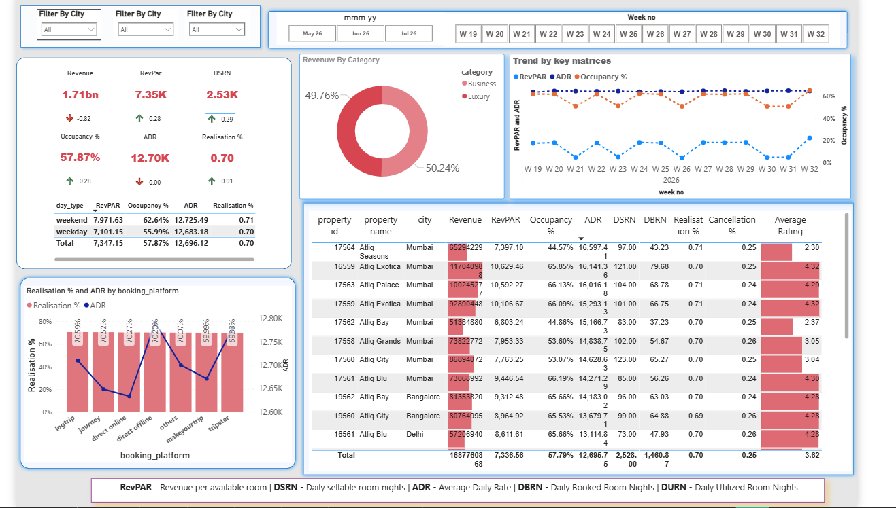
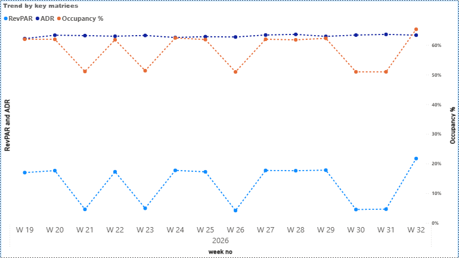
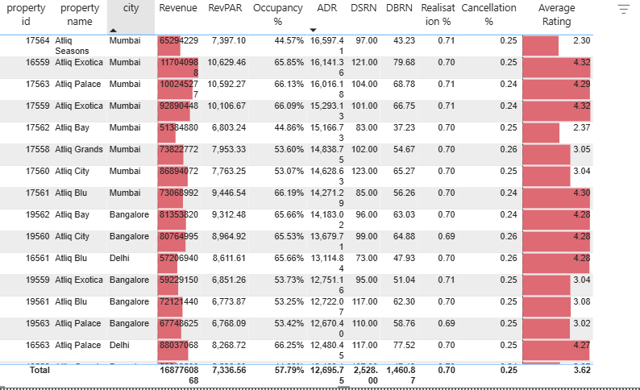

# AtliQ Grands – Hospitality Revenue Insights 🏨📊

Power BI analytics project for **AtliQ Grands**, a luxury hotel chain, to enable data-driven decision-making and regain market share through advanced revenue management.

## 📌 Problem Statement
AtliQ Grands has been a leader in the luxury hotel segment for 20 years. However, they are currently losing market share and revenue due to aggressive competitor moves and a reliance on ineffective decision-making processes. 

The objective of this project was to build a comprehensive dashboard to track key hospitality metrics, allowing the revenue management team to identify underperforming properties and untapped pricing opportunities.

## 🛠️ Technologies Used
* **Power BI Desktop** – For report development and data visualization.
* **Power Query** – For data cleaning and transformation (ETL).
* **DAX Language** – For creating hospitality-specific measures and KPIs.
* **Data Modeling** – Establishing relationships between property, room, and booking tables.

## 📊 Dashboards Overview

### 🏠 Home View
The navigation hub for the entire report. It provides a summary of the most critical KPIs: **RevPAR, ADR, Occupancy %, and Realization %**.

### 📈 Trend Analysis
Displays weekly and monthly trends for key metrics. 
* **Insight:** RevPAR and Occupancy show significant fluctuations, while ADR remains suspiciously flat.

### 🏨 Property Performance
A granular view of individual hotel performance.
* **Insight:** A clear correlation exists between low average customer ratings and low occupancy levels.

## 🧩 Key Hospitality Metrics (KPIs)
* **RevPAR (Revenue Per Available Room):** Total revenue divided by total rooms available to sell. This is the primary performance indicator.
* **ADR (Average Daily Rate):** The average price paid per room sold.
* **Occupancy %:** The percentage of available rooms actually sold.
* **Realization %:** Ratio of utilized room nights (actual stays) to total booked nights.
* **DSRN (Daily Sellable Room Nights):** The capacity of the hotel to sell rooms on a daily basis.

## 🔍 Key Business Findings
* **Dynamic Pricing Opportunity:** The hotel currently uses a "flat" pricing model with little fluctuation in ADR between weekdays and weekends. Implementing dynamic pricing based on demand presents a significant revenue opportunity.
* **Rating-Occupancy Correlation:** Properties with ratings below 3.0 consistently show lower occupancy. This highlights the critical role of online reviews in attracting bookings.
* **Cancellation Trends:** High cancellation rates were noted in properties with low ratings. Customers likely book these as secondary "backup" options.
* **Pareto Principle (80/20 Rule):** Focusing management efforts on the bottom 20% of underperforming properties is the most effective way to improve overall business performance.

## 🎓 Skills Demonstrated
* **Technical:** Advanced DAX, data modeling, and performance optimization in Power BI.
* **Domain Knowledge:** Hospitality revenue management and industry-standard KPIs.
* **Soft Skills:** Business requirement gathering, stakeholder communication, and data storytelling.

## 🙌 Acknowledgements
This project was inspired by the Codebasics Power BI Challenge and industry insights from Abhishek Anand and Hemanand.
